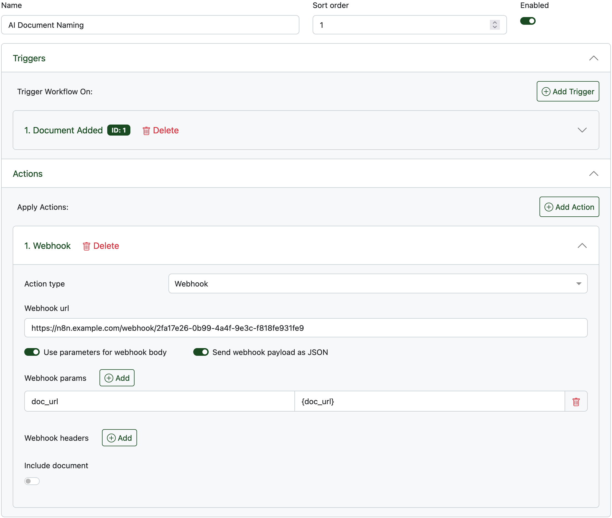
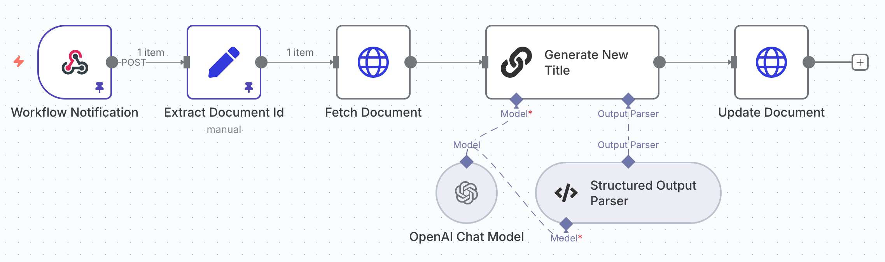

It's been a while since I posted on here, so in an effort to avoid my personal site looking abandoned, I figured I'd add a brief post about an automation I recently set up. Who knows, maybe someone will find it useful.

## Background
If you know me, you'll know I'm a fan of being organised. It also comes with the territory of the work I do. But I don't like organisation for organisation’s sake. If some rule or structure consumes more time than it saves, then it needs to be reconsidered, or dropped completely. For example, people might expect the contents of my kitchen cupboards to be categorised, fully fronted and date rotated, but there's little to be gained from this, so they're not.

A few years ago, I started using a self-hosted document management system called Paperless (specifically [paperless-ngx](https://docs.paperless-ngx.com/)). This allows me to store a digital copy of all my letters, payslips, certificates, bills, receipts etc. There's a bit of admin adding everything to the platform, but that time is easily recouped when a mortgage broker asks for 2 years of payslips, a council tax bill and my last 4 Ikea receipts (ok, maybe not that last one).

I use a fantastic iOS app called [Genius Scan](https://apps.apple.com/us/app/scanner-app-genius-scan/id377672876) to quickly scan any physical documents. These then get automatically uploaded to my Paperless instance via a WebDAV server running alongside it.

Any uploaded document ends up in Paperless' "Inbox". Then, every now and again, I'll go through each document in the inbox to ensure I still want to keep it long term, add any relevant tags / document types and check the date it detected is correct. The other thing I do is rename the generic filename (e.g. "2025-09-18 17:13.pdf") to something a little more useful (e.g. "Ikea Meatball Receipt.pdf").

The last step of having to rename all the inbox documents put me off doing this admin task. It was a faff that, whilst useful, wasn't strictly necessary. And so, following the mantra of avoiding organisation for organisation's sake, I considered stopping it and leaving the generic filenames.

## Wait, what year is it again?
But then I remembered that it's 2025, and AI is a thing now! So I set out looking for a way to use AI to automatically rename the scanned documents.

The first question was, can I get Paperless to "do something" when a new document is added. Luckily, the answer to that was "yes". Paperless supports webhook events with their "Workflows" feature. I created a workflow that would call a webhook URL (more on that later) whenever a document was added:



*Edit: In the version of Paperless depicted in the screenshot above, single curly braces were required for the `doc_url` template field. This has since change to the more standard double curly braces i.e. `{{doc_url}}`.*

Next up, I needed something to handle the webhook call and do all the processing. This seemed like the perfect use case for the [n8n](https://n8n.io/) automation platform (another service I self-host). As well as supporting webhooks, n8n also integrates with OpenAI and includes many powerful AI workflow tools. Here's what I landed on:



**Workflow Notification** - This is the node that exposes a URL on which to receive the webhook payload.

**Extract Document Id** - Unfortunately, I couldn't find a way to send the document ID in the webhook payload (the docs on this feature are sparse). So instead, I send the URL for the added document. This node extracts the document's ID from that URL.

**Fetch Document** - This node calls the Paperless API to get the full details of the added document (including the text content).

**Generate New Title** - This node passes the document's content to the OpenAI API along with the following prompt:

```text
Task:
Based on the extracted document content below, provide a filename for the document. Use title case with spaces. Try to keep the filename short and to the point. Do not include dates in the filename unless it is an annual document, in which case include the full year (e.g. 2025) or shortened tax year range (e.g. 24/25). Do not include a file extension.

Content:
{{ $json.content }}
```

The 'Structured Output Parser' node then enhances this prompt to ensure the AI model responds using a known JSON output format.

**Update Document** - Finally, the Paperless API is called again to update the document's title with that generated by the API model.

## Conclusion
All in all, I'm pretty happy with this little addition. It might have taken an hour or so to get set up, but in the long run it'll save me plenty more time. Plus, the regular task of managing the Paperless inbox is now much easier to stomach.
