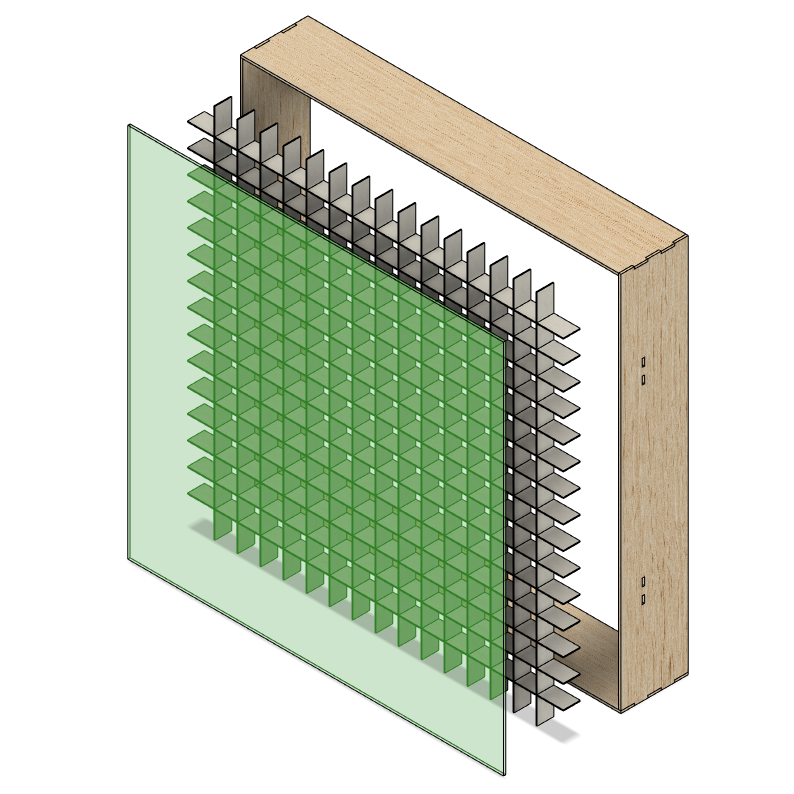
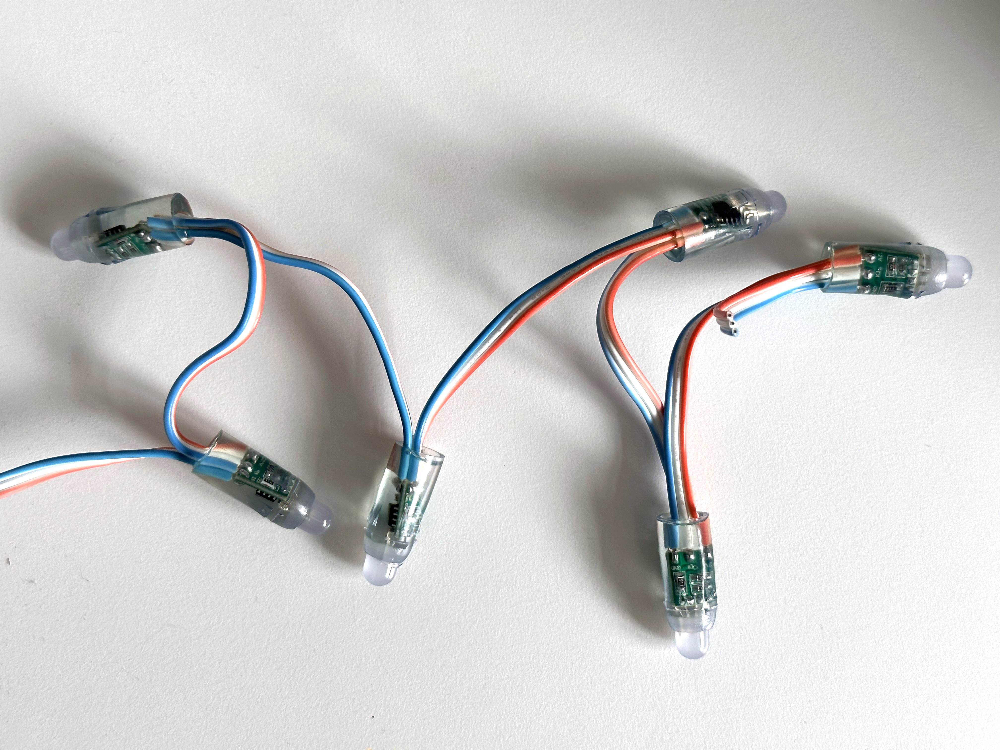
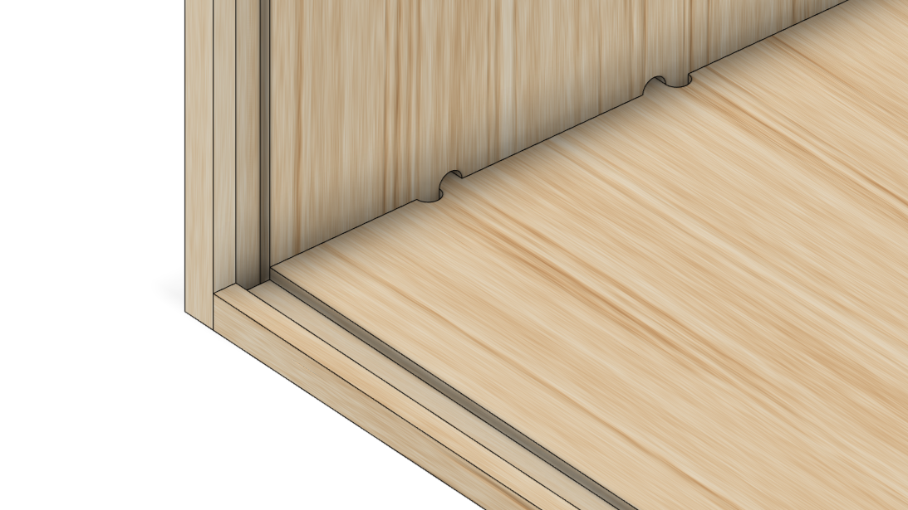
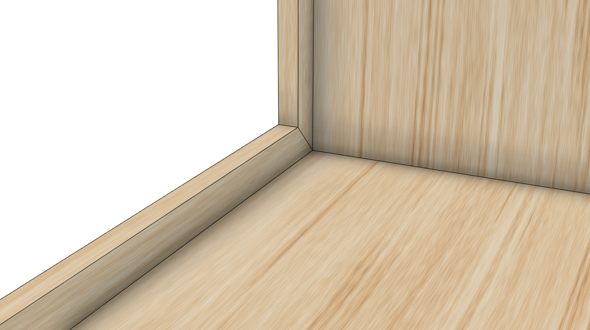
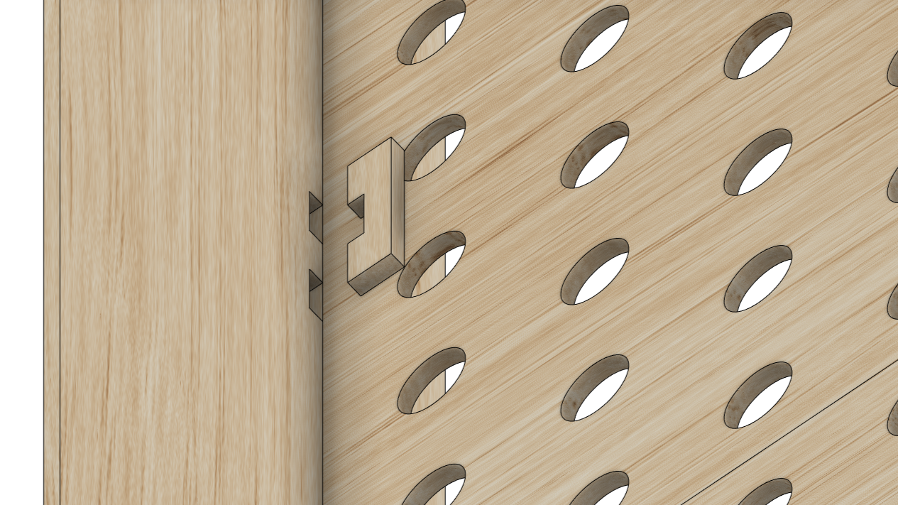

I'm in the camp that believes that if you're using the main ceiling light, you're doing it wrong. Because of this, I'm a big fan of LED strip lighting.

Amongst others, we have strips fitted on our kitchen cabinets, under the TV cabinet, running up the stairs and I've also made a DIY version of [this corner lamp](https://www.amazon.co.uk/Colour-Changing-Minimalist-Dimmable-Controller/dp/B08G56GZ1D) which is currently lighting up our living room. All of these [individually addressable](https://www.thesmarthomehookup.com/beginners-guide-to-individually-addressable-rgb-led-strips/) (generally 5v WS2812B) and are controlled using the fantastic open source project [WLED](https://kno.wled.ge/).

Whilst playing Minecraft with my daughter, I got to thinking about making a 16x16 pixel LED matrix that could be used to display Minecraft block art (each side of a block in Minecraft is represented by a 16x16 image). It sounded like a great excuse to learn 3D modelling and so off I went.

## Avoiding the Soldering Iron

In terms of the general design, I had a rough idea in mind. The lamp would have an outer box, an acrylic panel to diffuse the light and then an internal grid panel of baffles to separate each "pixel" cleanly.

A big goal of the design was to minimise the assembly work required. I'd rather spend more time in software where I'm more comfortable and where iteration is free.

As for the LEDs, my initial idea was to simply parallel mount 16 x 16 long strips to a back board. With an LED count of 30 LEDs per meter, this would result in a "pixel" size of around 3.3cm and an overall lamp size of around 53.3cm. The sizing seemed ideal but this method would require around 100 soldered connections! This is something I really wanted to avoid. Not just because it went against the "simple to assemble" design principle but, with my soldering skills, this would equate to around 100 potential points of failure.

My other concern was around cabling between each strip. With each pixel being a sealed box I'd either need to run the cables out the back of the backboard or through the baffles. Both option would require some very tight corners and may be visible through the acrylic panel.

You _can_ buy pre-made LED matrix panels but I couldn't find any with a similar LED pitch (3.3cm).

Then I came across the "string" style of LEDs:

With this style I could push all of the LEDs through holes in the backboard and have all cabling hidden behind.

# 3D Modelling

For the 3D modelling I chose to use [Fusion 360](https://www.autodesk.co.uk/products/fusion-360/overview) as it's well regarded and free for personal use. What I particularly liked was the concept of [parametric modelling](https://en.wikipedia.org/wiki/Parametric_design) whereby you can define the dimensions of your model as parameters which, if later changed, update the entire model.



My original intention was to have the parts CNC cut. This was based on my incorrect belief that it would be cheaper and more available than laser cutting. The benefit of CNC as opposed to laser would be that I could cut a channel in the outer box to accommodate the acrylic panel.

The downside of CNC is that tight internal corners aren't possible and so in places where these are needed you need to add what are called "dogbones". I was planning to use a [box joint](https://en.wikipedia.org/wiki/Box_joint) to join the outer box panels and to achieve this I'd need to use dogbones.



After some research I found that laser cutting services were more widely available and inexpensive as I'd initially thought and so I changed tack and started targetting a laser cut design. With the channel for the acrylic panel no longer possible, I needed to use a different method to hold it in place. To solve this, I chose to add a bezel to the front of the outer box which would retain the acrylic panel.

Lastly I added a number of slots to the outer box. Once the acrylic panel, baffles and backboard were in place, pegs could be pushed through the slots to hold everything together.

## Acrylic Panel

For the acrylic panel, I initially ordered 4 different samples with varying levels of light transmission. I chose to use the official Perspex® brand as I knew I could make repeat purchases in the future and be confident that the material would be the same. The 4 variants I sampled were:

| Variant  | Light Transmission |
| -------- | ------------------ |
| 028 Opal | 25%                |
| 050 Opal | 36%                |
| 040 Opal | 46%                |
| 030 Opal | 67%                |

I tested each of these with LEDs at varying distances and ultimately decided on 040 Opal. This provided a good balance of light diffusion and brightness. These tests also helped me decide on how far back to set the LEDs (22mm).

## Electronics

The string style LEDs I chose were 12v WS2811 which, like the WS2812B's I'm used to, are individually addressable. The crucial difference is that they are 12v which will really help with voltage drop across the 256 LEDs. For the amperage required, it also seems easier to get hold of 12v power supplies.

For the microcontroller I was planning on using an ESP8266 or ESP32 but as these these require 3.3v (and the LEDs 12v) I'd need to handle 2 different voltages. Luckily, I came accross a board that would solve all this for me called a [QuinLED Dig Uno](https://quinled.info/pre-assembled-quinled-dig-uno/). This would take a 12v input, would output 12v to the LEDs and also supply the onboard ESP32 with the voltage it needs. As a bonus, it also comes pre-flashed with WLED.

## Laser Cutting

The process of ordering laser cut parts was new to me and so I went in search for a supplier that could also provide some advise. I found a number of UK based companies, some even local to me, but the one that stood out to me was [Laser Lab](https://laserlab.co.uk/). They have an excellent [Design Setup & FAQ page](https://www.laserlab.co.uk/index.php?seo_path=design-setup-faq) that covers everything you need to consider when sending them a design to cut. Their pricing is also very straight forward. You pay for the material you need and the laser cutting services is built into the price.

Next step was to take my 3D model in Fusion 360 and export a 2D vector image that could be used by Laser Lab. In fact, as I would need to use multiple sheets of material, I'd need to split the model across multiple exports. Fusion 360 does have a way to do this automatically but unfortunately that functionality is reserved for their paid plans. You can do the process manually on the free plan but it's a long winded process that I'd need to repeat if I needed to make any changes to the model.

After some research I discovered a Fusion 360 plugin called [MapBoards Pro](https://apps.autodesk.com/FUSION/en/Detail/Index?id=3399489440307590024&os=Win64&appLang=en). For a one-off cost of $25 this would allow me to export a 3D model in Fusion 360 across as many files as needed. You simply specify the size of the material being cut from and it will automatically split the model across multiple files.

The other thing that MapBoards Pro does is to compensate for kerf. Kerf is essentially the width of the blade you are cutting with or in this case, the width of the laser. If you don't compensate for kerf then the parts you receive will be slightly smaller than you expect. MapBoards Pro can automatically adjust the size of the parts to compensate for a specified kerf width. Handily, Laser Lab details the kerf width for each material they supply.

In terms of materials I chose 3mm Birch Plywood for the outer box, backboard and bezel. For the internal baffles I chose 1.25mm mountboard.

## Assembly

Once the all of the parts had arrived I started by assembling the baffles. These were incredibly easy as they just slotted together.

Next up was the outer box. For this I used wood glue on the box joints and then clamped them together using a corner clamp. This ensured that they set at the correct angle. One thing I did find with the outer box is that the 3mm ply had a slight bow. To counter this I tried to arrange the panels in a way such that the bow was internal. This would then be corrected when the acrylic panel was inserted. This wasn't a big deal but if I were to do this project again I might consider a thicker ply.

Out of the entire assembly process, the bezel was the most fiddly. This was because the bezel is made up of 4 separate pieces that needed to be glued together and also to the outer box. Getting the alignment right was tricky and not helped by the slight bow in the side panels.

The acrylic panel arrived pre-cut and so the assembly process _should_ have been as simple as lowering it into the box. Unfortunately though, it arrived a good couple of mm larger than ordered and so required a fair amount of filing to get it to fit. The bezel would have hidden any gaps and so I might consider ordering the acrylic panel slightly smaller next time.

The baffles were then lowered into box and sat on top of the acrylic panel. The backboard was then lowered into place and the pegs pushed through the slots to hold everything together. Without any built in tolerances, I expected that I may have issue inserting the pegs. It was certainly tight but with a bit of sanding I was able to get them in.

The last step was to push the LEDs into the back board and then wire everything up. I had tested the LED hole diameters using a 3D printed test part and so was fairly confident that the LEDs would simply push fit. Luckily, this was the case. Some are a little loose and wouldn't survive a knock but I'm not planning on moving this around much. It's also nothing a blob of hot glue wouldn't solve.

## Software

Fortuitously, whilst I was busy designing, ordering and assembling the light, the WLED team were busy releasing a new beta version that included support for LED matrix's! This meant I could display 2 dimensional animations or images on the light without needed to create anything custom (my original intention).

## Final Product

[IMAGE/VIDEO OF FINAL PRODUCT]

Overall I'm really happy with how this turned out....

## Part List

| Item                     | Cost (inc Shipping) |
| ------------------------ | ------------------- |
| Laser Cutting + Material | £89                 |
| Opal 040 Acrylic Panel   | £28.43              |
| LEDs                     | £78                 |
| QuinLED Dig Uno          | $38.56 (\~£31.68)   |
| Power Supply             | £19.97              |
| **Total**                | **£247.08**         |
